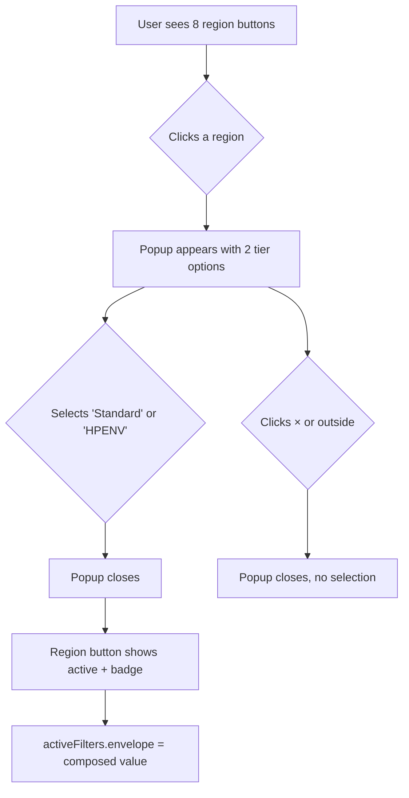

# Walkthrough — Envelope Region + Popup Refactor

> **Status**: ✅ Completed  
> **Date**: 2026-08-04  
> **Scope**: `layer1_NUs_selection.html`, `css/styles.css`, `js/app.js`

---

## Summary of Changes

This refactor simplifies the Envelope parameter section in the Layer 1 selection page by replacing the current **14-button grid** (7 standard + 7 high-performance) with a **2-step selection flow**:

1. **Step 1**: User clicks one of **8 region buttons** (ASHRAE, NECB Z4–Z8)
2. **Step 2**: A small popup appears offering **2 performance tiers**: "2017" (NECB 2017) and "HPENV" (hyper-performance)
3. **Result**: The popup closes and the region button shows the selected tier via a small badge

This reduces visual clutter and is **future-proof** — adding new regions only requires adding one button (not two), and new tiers only require adding a button inside the popup.

---

## Files Modified

| File | What Changed |
|------|-------------|
| [`layer1_NUs_selection.html`](file:///C:/Users/o_iseri/Desktop/LMN-tool-main/layer1_NUs_selection.html) | Replaced 14 envelope buttons with 8 region buttons + popup HTML |
| [`css/styles.css`](file:///C:/Users/o_iseri/Desktop/LMN-tool-main/css/styles.css) | Updated `.envelope-cards` grid, added popup overlay + tier button styles |
| [`js/app.js`](file:///C:/Users/o_iseri/Desktop/LMN-tool-main/js/app.js) | Refactored `setupEnvelopeCards()` for 2-step flow, updated `updateAvailableOptions()` |

---

## UX Flow Diagram



---

## Before vs After

### Before (14 buttons)
```
Standard:   [ASHRAE] [Z4] [Z5] [Z6] [Z7A] [Z7B] [Z8]
High-Perf:  [HP-ASHRAE] [HP-Z4] [HP-Z5] [HP-Z6] [HP-Z7A] [HP-Z7B] [HP-Z8]
```

### After (8 buttons + popup)
```
Regions:    [ASHRAE] [Z4] [Z5] [Z6] [Z7A] [Z7B] [Z8]
                        ↓ click
                 ┌──────────────────────┐
                 │ [Standard]  [HPENV]  │
                 └──────────────────────┘
```

---

## Value Composition Logic

When a user selects region `necb-z6` and tier `high-performance`, the composed value is:
- Standard (2017): `necb-z6`
- High-Perf (HPENV): `high-performance-z6`

For ASHRAE:
- Standard (2017): `ashrae`
- High-Perf (HPENV): `high-performance-ashrae`

This maps exactly to the existing `data.js` envelope keys — **no data changes needed**.

---

## Testing Checklist

- [ ] 8 region buttons render correctly
- [ ] Popup appears on region click
- [ ] "2017" tier sets standard envelope value
- [ ] "HPENV" tier sets high-performance envelope value
- [ ] Badge appears on region button after selection
- [ ] Switching regions clears old selection
- [ ] Popup closes on × click
- [ ] Popup closes on outside click
- [ ] `sessionStorage` stores correct composed envelope value
- [ ] Layer 2 navigation receives correct envelope parameter
- [ ] Responsive layout works at mobile widths
- [ ] `updateAvailableOptions()` correctly enables/disables region buttons

---

## Backward Compatibility

> [!NOTE]
> **No breaking changes.** The composed `data-value` strings (`ashrae`, `necb-z6`, `high-performance-z6`, etc.) remain identical to the current system. All downstream pages (`layer1_output.html`, `layer2_energy_selection.html`, etc.) and `sessionStorage` logic continue to work without modification.
